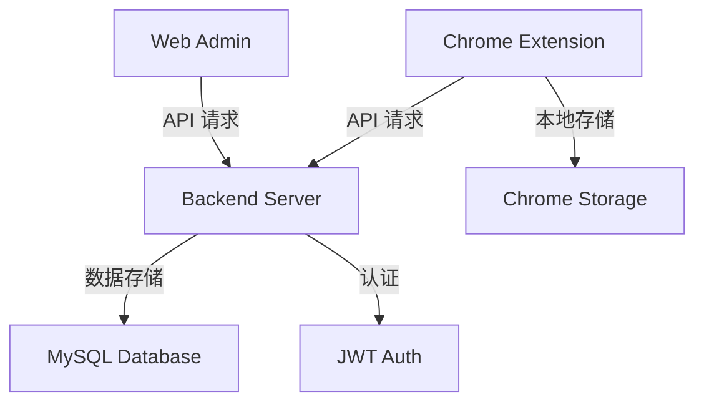

# 网页笔记本

一个现代化的网页笔记系统，支持网页划词保存、实时同步、智能管理和自动高亮功能。本项目采用全栈开发方案，包含 Node.js 后端服务、React Web 管理端和 Chrome 浏览器扩展。

## 技术栈

### 后端 (Backend)
- **框架**: Node.js + Express.js
- **数据库**: MySQL
- **认证**: JWT (JSON Web Token)
- **其他**: 
  - bcryptjs (密码加密)
  - ExcelJS (Excel导出)
  - CORS支持
  - 环境变量配置

### Web管理端 (Web Admin)
- **框架**: React 18
- **路由**: React Router v6
- **UI**: Bootstrap 5 + Font Awesome
- **状态管理**: React Hooks
- **样式**: 自定义CSS + 响应式设计

### 浏览器扩展 (Chrome Extension)
- **类型**: Chrome Extension Manifest V3
- **特性**: 
  - 内容脚本注入
  - 上下文菜单集成
  - 本地存储
  - 跨域通信

---

## 系统架构



## 功能特性

### 核心功能
- 🔍 **智能划词**：任意网页文本选择与一键保存
- 🔄 **实时同步**：扩展端与管理端数据实时同步
- 🎨 **智能高亮**：自定义颜色、自动恢复、悬停提示
- 📝 **全文检索**：支持内容、标签、URL模糊搜索
- 📊 **批量操作**：支持批量删除、Excel导出
- 🔒 **安全认证**：完整的用户认证和鉴权系统

### 技术特性
- ⚡ **性能优化**：异步加载、DOM监听、缓存管理
- 🛡️ **安全防护**：密码加密、Token验证、CORS配置
- 📱 **响应式设计**：支持各种设备屏幕尺寸
- 🔌 **可扩展性**：模块化设计、API版本控制

---

## 快速开始

### 环境要求
- Node.js >= 14.0.0
- MySQL >= 5.7
- Chrome浏览器 >= 88

### 1. 后端服务
```bash
cd backend
npm install
# 配置环境变量
cp .env.example .env
# 编辑 .env 文件配置数据库信息
npm start
```

环境变量配置示例：
```env
DB_HOST=localhost
DB_USER=root
DB_PASS=your_password
DB_NAME=webnotebook
JWT_SECRET=your_secret_key
PORT=3001
```

### 2. Web管理端
```bash
cd web-admin
npm install
npm start
```

### 3. Chrome扩展
1. 打开Chrome扩展管理页面 `chrome://extensions/`
2. 开启"开发者模式"
3. 点击"加载已解压的扩展程序"
4. 选择 `extension/` 目录

---

## API文档

### 认证接口
- POST `/api/auth/register` - 用户注册
- POST `/api/auth/login` - 用户登录
- GET `/api/auth/me` - 获取当前用户信息

### 笔记接口
- GET `/api/notes` - 获取笔记列表
- POST `/api/notes` - 创建新笔记
- PUT `/api/notes/:id` - 更新笔记
- DELETE `/api/notes/:id` - 删除笔记
- POST `/api/notes/batch-delete` - 批量删除
- GET `/api/notes/export` - 导出笔记

---

## 开发指南

### 代码规范
- 使用ESLint进行代码检查
- 遵循React Hooks最佳实践
- 使用async/await处理异步操作
- 保持一致的错误处理方式

### 安全考虑
- 所有API请求需要JWT认证
- 密码加密存储
- 防止XSS和CSRF攻击
- 限制API请求频率

### 扩展开发
- 遵循Chrome Extension最佳实践
- 使用content scripts注入页面
- 正确处理跨域请求
- 实现优雅的错误处理

---

## 常见问题

### 1. 高亮显示问题
Q: 页面刷新后高亮消失？  
A: 系统已集成自动恢复机制，通过DOM监听确保高亮持久化。

### 2. 认证问题
Q: Token过期处理？  
A: 系统会自动处理过期Token，引导用户重新登录。

### 3. 性能问题
Q: 大量笔记加载缓慢？  
A: 已实现分页加载和懒加载优化。

---

## 贡献指南

1. Fork 项目
2. 创建特性分支 (`git checkout -b feature/AmazingFeature`)
3. 提交更改 (`git commit -m 'Add some AmazingFeature'`)
4. 推送到分支 (`git push origin feature/AmazingFeature`)
5. 提交Pull Request

---

## 开源协议

MIT License

---

## 更新日志

### v1.0.0 (2024-03)
- 初始版本发布
- 完整的笔记管理功能
- Chrome扩展支持
- Web管理界面 